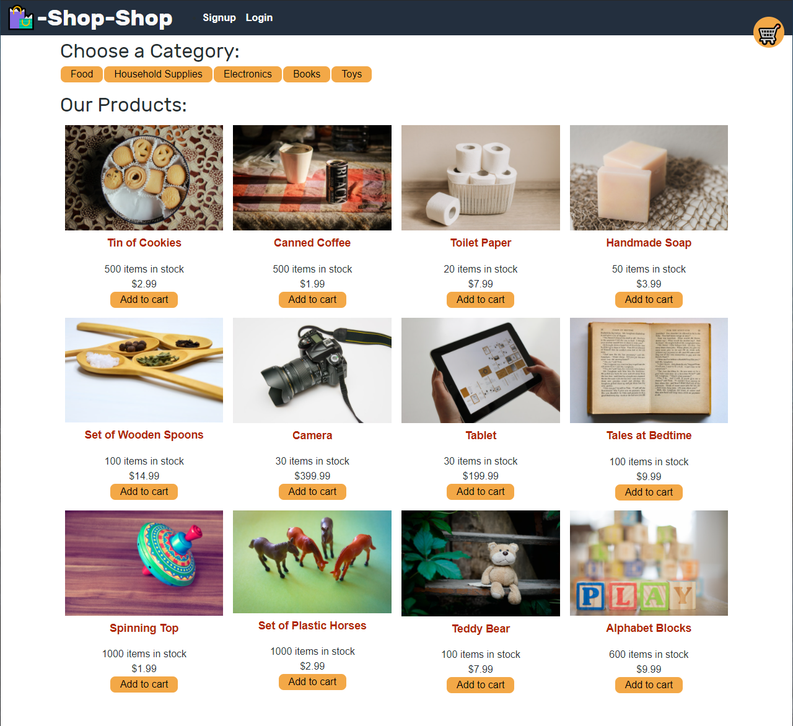
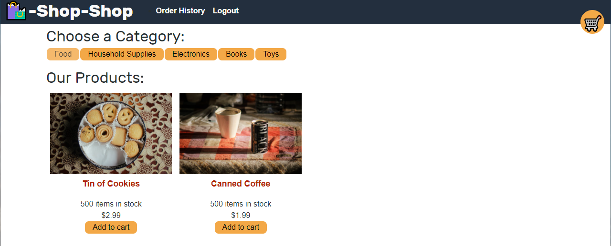
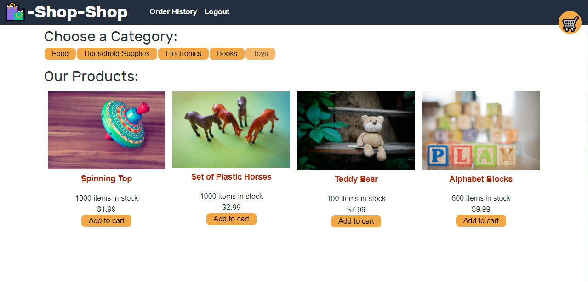
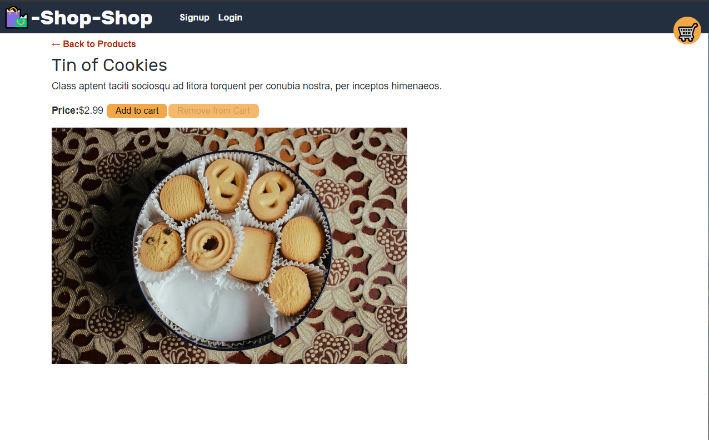
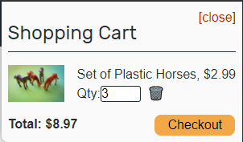
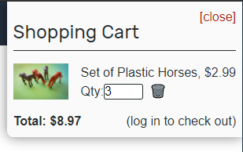
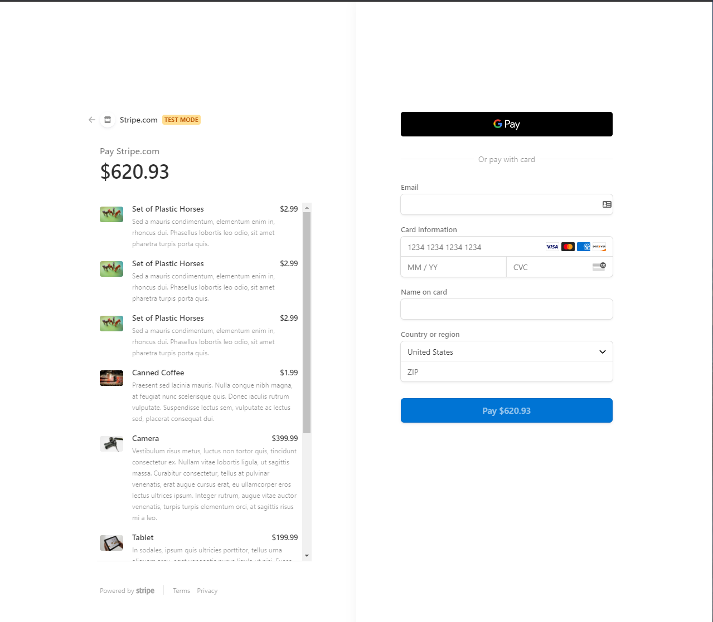
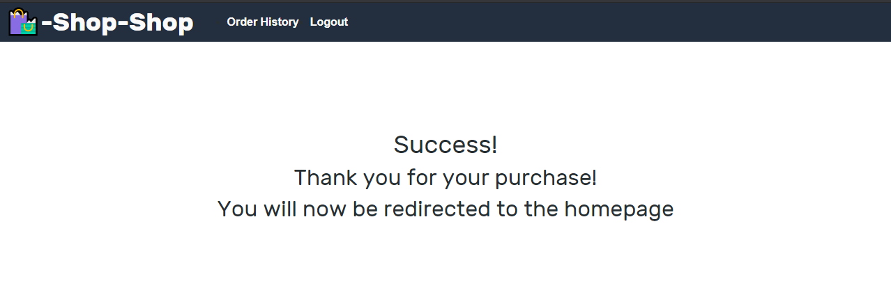
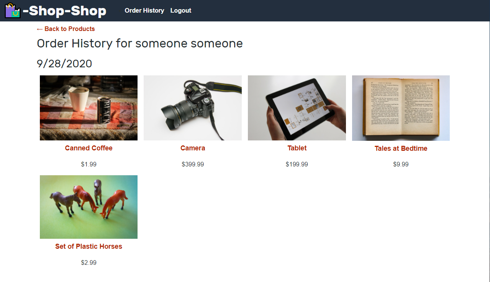

# Book Search Engine 

## Links

Repository Link: [Shop Shop Repo](https://github.com/MasonMarinko/shop-shop-redux/)

Live URL Link: [Shop Shop Site](https://shop-shop-redux-2.herokuapp.com/)

## Description

- Shop-Shop is an e-commerce site where you can buy a variety of items. Add things to your cart, whether logged in or not and your order will stay even when refreshing the page. If you want to checkout you will need to login. Once checked out you can look at previous items you have ordered.

## Table of Contents
* [Usage](#usage)
* [License](#license)
* [Questions](#questions)

## Usage/Features

1) When you first go to the site you are greeted with a variety of items. Each item shows you how many are in stock, the price and allows you to add the item to your cart. In the nav bar you are able to login/sign-up and/or look at your cart. Once you have signed up or logged in you will have an option that allows the user to to look at Order History.

2) While at the home page the user has tabs under "Choose a Category" where they can narrow down the items in the shop by category. The images above demonstrate if the user were to select the "food" or "toys" category.

3) The user can also select a specific item to bring up more information than is available on the home page. They also have the option to "add to cart" or "remove from cart". 

4) If you select the cart option to the right of the nav bar you are able to see the 2 different views if a used is signed in or not. If they are not signed in the user can add items to cart, remove them by selecting the trash can and where the "checkout" button would be it says "login to checkout". If the user is logged in the option will change to a checkout button.

5) If the user selects to check out they are taken to the "Stripe" checkout page. On this page the user can see the items they are checking out with, how much it is going to be and can enter their payment information.

6) Once the user checks out they are greeted with a success page then automatically re routed after a few second to the shop-shop home page.

7) Once a user has made at least 1 order they can select "Order History" where they can look at previous orders they have made on that account.

## License
This project is covered under the following license(s):
ISC

## Questions? Ask Us:

GitHub Profiles:

- [Mason Marinko](https://github.com/masonmarinko)

Questions? Contact Us:
- [Mason Marinko](<Mason.P.Marinko@gmail.com>)